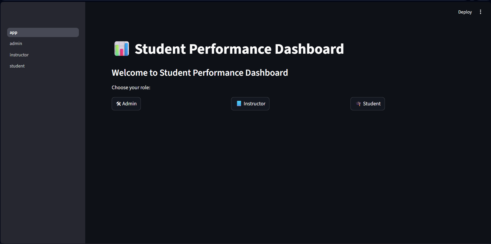
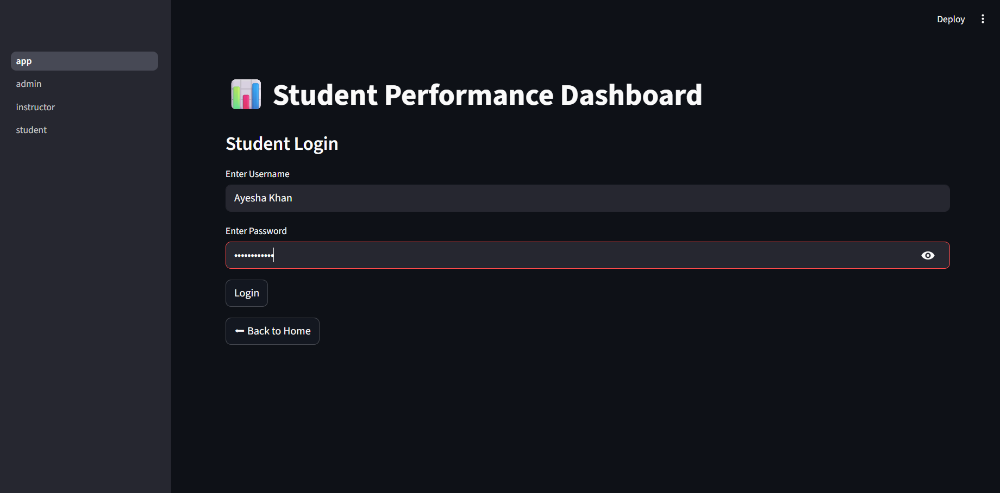
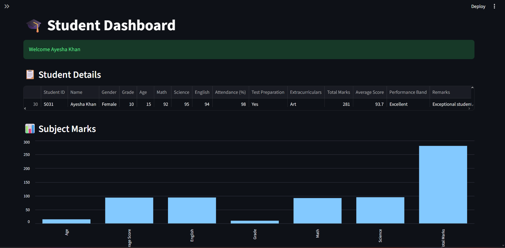
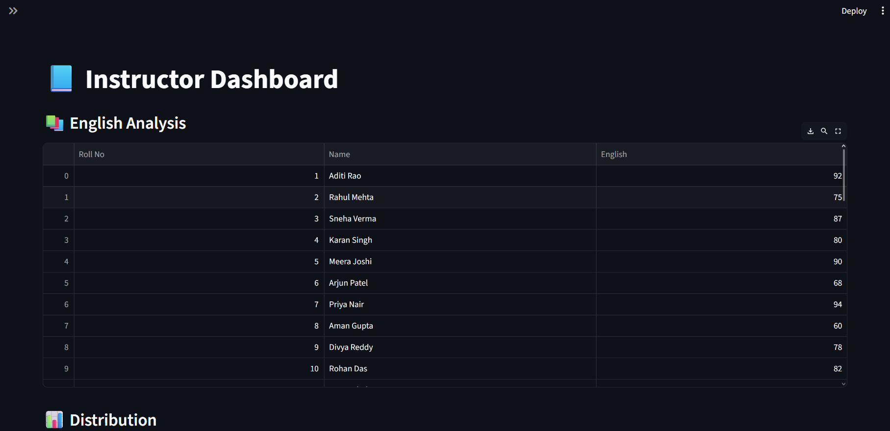
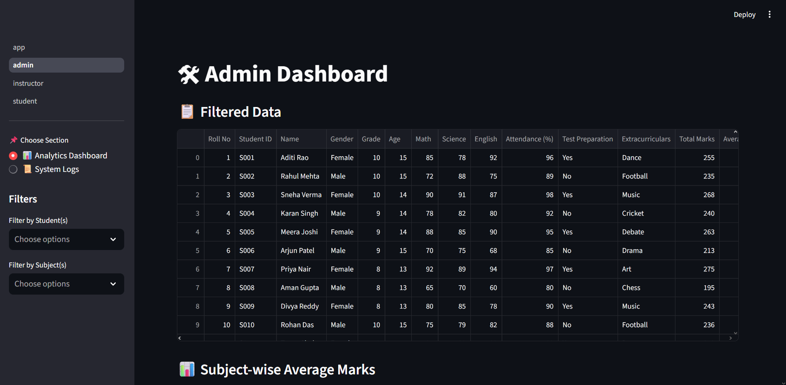
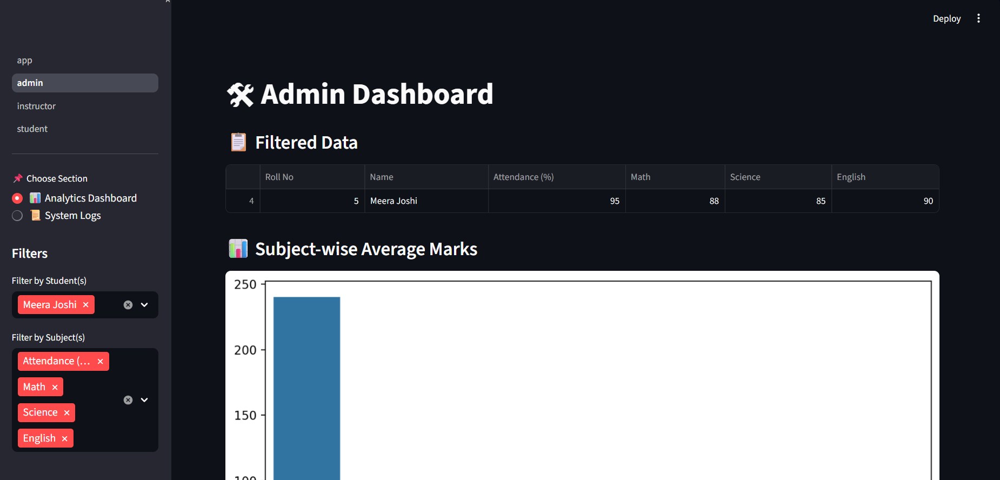
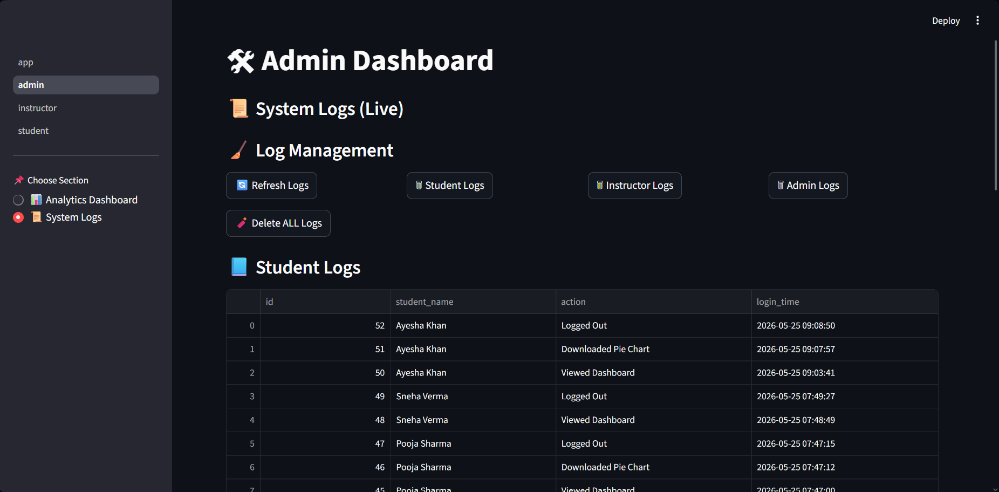

# 🎓 Student Performance Dashboard

## 📌 Project Overview
A role-based web application that analyzes student academic performance using interactive dashboards. Built using Python and Streamlit with data visualization and real-time logging features.

This project simulates a real-world academic management system with **Admin, Instructor, and Student roles**.

---

## 🎯 Key Outcomes

- 📊 Built interactive analytics dashboards for academic performance tracking  
- 🧠 Implemented role-based authentication system (Admin / Instructor / Student)  
- 📜 Developed real-time system logging using SQLite  
- 📈 Created dynamic data visualizations (charts, histograms, boxplots)  
- 📤 Enabled export of reports in CSV and Excel formats  

---

## 📊 Key Features

- Role-based login system  
- Real-time activity logging  
- Data visualization dashboards  
- Data export (CSV, Excel)  
- Admin control panel  
- Filter-based analytics  

---

## 👤 User Roles & Features

### 🎓 Student
- View personal marks, GPA, and attendance  
- Visualize subject-wise performance  
- Download performance reports  

### 👨‍🏫 Instructor
- Subject-wise performance analytics  
- Top 10 student rankings  
- Score distribution analysis  

### 🛠 Admin
- Full system dashboard access  
- Monitor student/instructor/admin logs  
- Export filtered data  
- Manage logs (refresh & delete functionality)  

---

## 🧰 Tech Stack

- Python  
- Streamlit  
- SQLite3  
- Pandas  
- NumPy  
- Matplotlib  
- Seaborn  
- Scikit-learn  

---
## 📸 Screenshots

### 🏠 Application Home / Login


---

### 🎓 Student Login


### 📊 Student Dashboard


---

### 👨‍🏫 Instructor Dashboard


---

### 🛠 Admin Dashboard Overview


### 🔍 Admin Data Filtering


### 📜 System Logs (Student Activity)



## ⚙️ Setup Instructions

```bash
pip install -r requirements.txt
streamlit run app.py

## 📌 Other Details

This project demonstrates a complete role-based student performance management system with analytics, visualization, and logging features.

## 👨‍💻 Author

**Bhagya Sri**  
Final Year Student  

🔗 GitHub: https://github.com/BhagyaSri489
🔗 LinkedIn: https://linkedin.com/in/bhagyasri-thutta